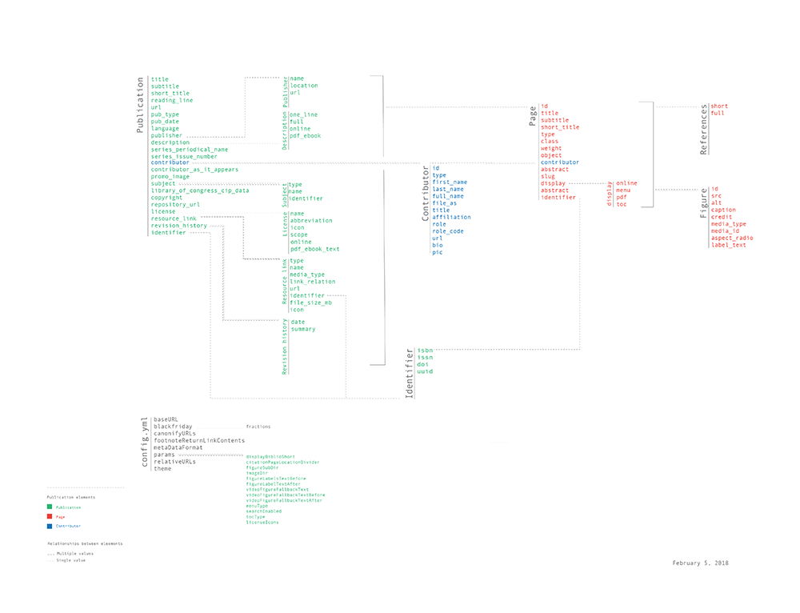
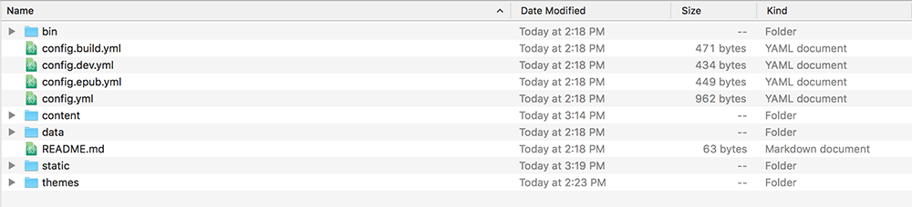
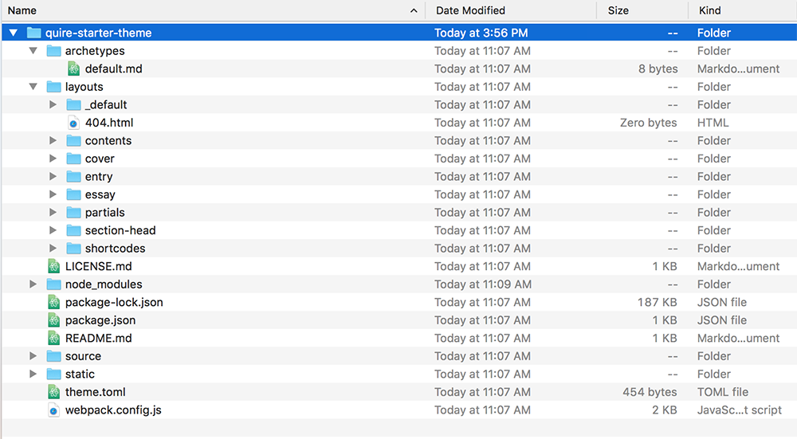

## History

In 2009, the Getty Foundation launched a program called the [Online Scholarly Catalogue Initiative](http://www.getty.edu/foundation/initiatives/past/osci/index.html) (OSCI) to support eight museums’ efforts to publish their collection catalogues online. Having traditionally been published in print, collection catalogues were costly to produce, offered relatively little access (mostly through research libraries that would collect them), and were difficult, if not impossible, to update. At then end of the initiative, all eight museums had successfully published one or more collection catalogues online and had plans to do more. As discussed in the OSCI final report, however, some [notable challenges remained](https://www.getty.edu/publications/osci-report/remaining-challenges/), particularly around the *discoverability* of the catalogues after publication, and the *longevity* of the catalogues, both as individual digital objects out in the world and as publication processes internally.

Around the time OSCI was wrapping up, Getty Publications was starting to undertake our own online publishing efforts. Though we had produced [a single, trial online collection catalogue](http://museumcatalogues.getty.edu/amber/) during the OSCI period, our renewed effort was focused on learning the lessons from that past project as well as from OSCI. Specifically, we aimed for a way to make these types of born digital publications more discoverable and longer lasting, while doing so in way that would be more sustainable internally. Enter [static site generators](https://www.smashingmagazine.com/2015/11/modern-static-website-generators-next-big-thing/), and multi-format publishing.

Static site generators like Hugo, the one under the hood in Quire, allow us to keep our content in plain text, and keep the complexity of building the site at the point of publication, rather than relying on ongoing build processes through a server that would need to be continually maintained. We could also use the static site generator (hooked together with some other tools) to put that plain text content into formats other than online sites. Formats like PDF, e-book and even print, that would allow the publication to live where other publications live (bookstores, Amazon, Google Books, the Library of Congress, WorldCat) and thereby dramatically improve its discoverability and its archival longevity.

## Who Uses Quire?

We built Quire first for ourselves. In the last two years, we’ve published seven publications with early versions of Quire, and have seven more in the pipeline for the next two years. We’re also starting to look at ways at expanding its usage to other projects around the Getty, potentially including the annual report, documentation and reports, newsletters, and even online exhibitions.

## What is Quire’s Goal?

## What Are the Benefits of Using Quire?

## What Is Quire?

Quire is an open-source framework for the creation of multi-format publications. It consists of two distinct parts: 1. a set of software, and 2. a defined content model.

1. Quire Software

    On the software side, Quire packages together a number of programs: [Prince](http://www.princexml.com/) for PDF/print versions, [pe-epub](https://github.com/peoples-e/pe-epub) for EPUB, and at the heart of things, the static-site generator [Hugo](https://gohugo.io/) for the online version. The file structure, layout templates, partials and shortcodes of Quire are all Hugo conventions that have been structured to allow us create more formal digital publications (essentially, dynamic websites that make use of of certain traditional print publication conventions like tables of contents, copyright and authorship information, linear reading orders, and the like).

2. Quire Content Model

    The content model is documented in the [API/Docs section](../api-docs) of this guide. It defines how publication content is structured and defined in Quire (including data on the publication itself, pages of the publication, contributors, figures, bibliography, etc.) and how the Quire software templates use this structured content. The content model is designed to be as independent of the Quire software stack as possible, so that long-term, it might be used in other ways. If, for example, any part of the Quire software were replaced with something new, or if the content of a publication were to be used for an entirely different use.

    

    Full size version of the [content model](https://github.com/gettypubs/quire-docs/tree/master/content/images/content_model_big.pdf)

## What Do the Quire Repositories Do?

While conceptually, Quire is made of the two distinct parts defined above, these play out in multiple working parts in actual practice.

### `quire-cli`

Quire CLI, or command line interface, ([quire-cli](https://github.com/gettypubs/quire-cli)) is the control for creating, previewing and outputting Quire projects. It is written in JavaScript and requires [Node.js 8.9.4 LTS](https://nodejs.org) to run. Quire CLI is typically run from Terminal on a Mac, and Git Bash (or its equivalent) on a PC. The following commands are available:

| Command | Description |
| -------------- | -------------- |
| `quire -V` or `quire --version` | Output the version number. |
| `quire -h` or `quire --help` | Output usage information. |
| `quire new project-name` | Create a new Quire project named `project-name` in the current directory. Name can be anything, but shouldn’t contain spaces. |
| `quire preview` | Run a local server to preview the project in a browser. Defaults to previewing at http://localhost:1313/, but will use other port numbers (such as http://localhost:6532/) if `1313` is busy. The specific address will be listed in your command line terminal after running the command. |
| `quire build` | Build the files of the current project into the `public` directory. These can then be hosted on any web server. |
| `quire pdf` | Generate a PDF version of the current project. |
| `quire epub` | Generate an EPUB version of the current project. |

Read more in [Setup](content/guide/setup.md), and [Multi-Format Output](content/guide/output.md).

### `quire-starter`

Quire Starter ([quire-starter](https://github.com/gettypubs/quire-starter)) is a starter content repository used as placeholder content when starting a new Quire project with the `quire new` command. It comes with some pre-defined example content and pages with which to get started.

### `quire-starter-theme`

Quire Starter Theme ([quire-starter-theme](https://github.com/gettypubs/quire-starter-theme)) is the basic theme that is included when starting a new Quire project with the `quire new` command. It is designed to broadly cover a full range of use-cases and to demonstrate the range of Quire content model, without being too overly specific or complex, making it easy to customize and build from. Read more about the use of themes in [Customizing Styles](content/guide/styles.md).

More themes will be added in the future.

### `quire`

Quire ([quire](https://github.com/gettypubs/quire)) is the repository for the guide and documentation you are currently reading.
