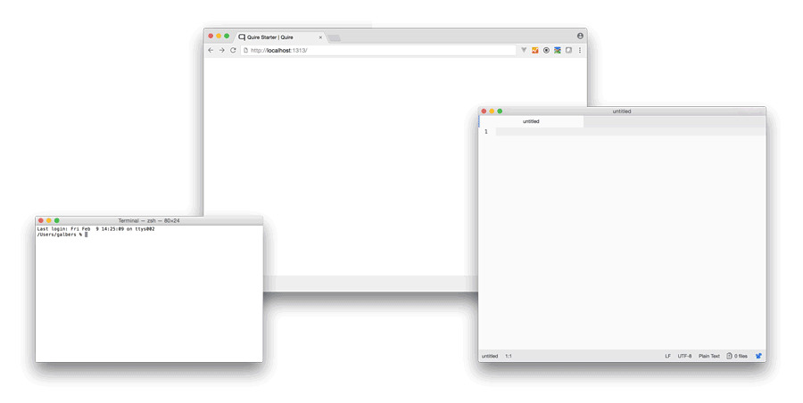

# Getting Started

Quire is a publishing *framework*, meaning it’s not one tool or process, but rather a network of many things hooked together. When you work in Quire, you’ll be using a text editor, a command line shell, and a web browser. You use the text editor to edit your publication files, the command line shell to tell Quire what to do (like `quire new` to start a new project and `quire pdf` to build the PDF version), and the web browser to preview your work.



In the following sections, we’ll get more familiar with these tools, and get you up and running with your first Quire project.

## 1. Installing Quire and Its Dependencies

Refer to the following resources via the links below for either Mac or PC installation.

[**Mac installation**](../resources/install-mac.md)

[**PC installation**](../resources/install-pc.md)

## 2. Create and preview a new starter project

*[For PC users, see the instructions in the [PC installation](../resources/install-pc.md) guide on starting and previewing new Quire projects.]*

To start a new Quire project, open your shell and type `quire new my-project`. Quire will download a new starter project named “my-project” into your current directory. (If you are using the Beta, you may need to enter your GitHub username and password twice during the download process. One for the starter kit and once for the starter theme.)

Once the download is complete, still in your shell, type `cd my-project` and hit enter (which means change directory into the directory called “my-project”, which was just created with the `quire new my-project` command), and then type `quire preview` and enter again.

```
cd my-project
quire preview
```

Open your browser and go to [http://localhost:1313](http://localhost:1313) to see the starter publication that Quire is now previewing.

## 3. Customize the metadata, content, and styles to make it your own

To start customizing your publication, you’ll need a text editor. This goes with the command line shell you have for installing and entering Quire commands, and the browser you use for previewing.

### Working in a Text Editor

Like its name implies, a text editor is simply a program to edit text. It’s like Microsoft Word, but instead of dealing with text formatted for printing, text editors specialize in text formatted for code and markup. You can use a text editor to edit all the different kinds of files in your Quire project, from chapters written in Markdown, to metadata written in YAML, and styles written in CSS.

Macs and PCs come with some simple text editors built-in, but we recommend using something like [Atom](https://atom.io/) which offers a more in terms of auto-formatting as well as being able to see and work in multiple text files at a time.

Once installed, open your text editor and locate and open the `my-project` directory you created in Step 2 above. If you’re using a text editor like Atom, you will see all of the directory’s contents listed.


### Publication Metadata

Start by opening the `data` directory, and the `publication.yml` file. This file is all the metadata for your publication, much of which is used in various areas of your site.

Try changing the title and subtitle, hitting save, and then looking at the preview running in your browser. You’ll see that the cover is updated with your new title. It’s also updated in the top navigation bar, and in the expandable menu on the site. As much as possible, Quire works on the principle of having content exist only in one place in your files, and using code to display it in multiple places in the publication as needed. This means when you make a change to something, you only do it once and it changes everywhere.

The format of this metadata is called YAML (*yam-ul*). It’s designed to be a plain text way of capturing data. The general principal is to have the name of the data items are followed by a colon, a space, and then the data item’s value. The names are always be lowercase letters and underscores for spaces. The values can be anything, but sometimes may need to be surrounded in quotes to avoid validation issues. You can always [copy and paste your YAML into an online validator](http://www.yamllint.com/) to check it.

```yaml
title: "My Quire Project"
```

The two other files in the `data` directory, [`figures.yml`](../figures.md) and [`references.yml`](../bibliographies.md), are data for figure images and bibliographic references. You can remove either if you won’t be using them.

*Read more in the [“Publication Configuration & Metadata”](../metadata.md) chapter of this guide.*

### Publication Content

Now open the `content` directory. In this directory are a series of Markdown files (`.md`) that hold the content of the publication. Each one represents a page of your website. The filename becomes part of the URL for that page in your final publication, so it’s always lowercase and includes no spaces or special characters.

Open the `about.md` file. At the top is a small block of YAML (surrounded in two sets of three dashes `---`) that gives the `title`, [`type`](#) and `weight` for that page. The `weight` value creates the sort order of pages for your book. The page in the `content` directory with the lowest value will be first, the rest will be ordered after it numerically. The numbering need not be consecutive.

Below the YAML block is where your content goes. Type something here, save the file and check the preview you’re running in the browser at [http://localhost:1313/about/](http://localhost:1313/about/). You should see the update.

Quire content is written in Markdown. Markdown allows you to express content structure as minimally as possible, using simple text indicators. Paragraphs are made with double line breaks; asterisks around text will make it italic, double asterisks will make it bold; headings are made with hashmarks preceding the heading text.

```
# Heading 1
## Heading 2
### Heading 3

*Italic Text*
**Bold Text**

[Link Text](http://www.linkadress.com)
```

Quire also extends Markdown’s capabilities with a set of [shortcodes](#). Type the following figure image shortcode on a new line in your `about.md` file, hit save and check the preview in your browser.
```

```

You’ll see that a figure and caption was added, the information for which is stored in the project’s `figures.yml` file under the `id` of "1.1". If you update the information stored in `figures.yml` it will update on your page, as well as anywhere else that figure is used.

*Read more about Page YAML, Markdown and Quire shortcodes in the [“Pages & Plain Text”](../text.md) chapter of this guide.*

### Publication Styles

There are number of different ways to customize the look of your publication. Some of the easiest are to add your own background image to your cover and any page banners you like, and to change the colors of different interface elements.

First, open the `cover.md` file and try adding `image: cover_bg.jpg` to the YAML block, hitting save, and previewing the results in the browser. The image itself is stored in the `static` directory of your project, in an `img` sub-directory. You can point the cover image to any image in this directory. You’ll see this is also where images are stored for use with the `q-figure` shortcode demonstrated above. Page banner images can be added in the same way, simply by adding an image filename under `image:` in the YAML for that page.

Next, we can change the colors used in various elements of the site design. For that, we need to look in the `themes` directory of the project. By default, the `quire new` command installs the `quire-starter-theme` here, but down the road, you could potentially switch in a different theme (once they are available). For now, look inside the theme for the `source/css` sub-directories and inside that, the `application.scss` file. Here you’ll find a number of variables, prefixed with a dollar sign, that are descriptive of what they control. For instance `$quire-navbar-background-color` is the background color of the navigation bar at the top of every page. Change it to something new, like a Hex value, or one of the [standard 140 color keywords](https://www.w3.org/TR/SVG/types.html#ColorKeywords), save the change, and preview in your browser.

```
$quire-navbar-background-color: honeydew;
```

Just make sure there’s always a space between the colon and the value you enter, and that the value is immediately proceeded by a semi-colon. If you don’t see the change, you may need to refresh the browser window.

PC users won’t yet be able to customize style variables in this way, but can instead edit the styles directly in `quire-starter-theme/static/css/application.css`.

*Read more about applying your own custom CSS styles, altering page templates, and creating a new theme in the [“Customizing Styles”](../styles.md) chapter of this guide.*

## 4. Output your publication

In your Terminal, if it is still running, stop the `quire preview` process by typing Control-C. To create the PDF version of your publication type `quire pdf` and Enter. For the EPUB, type `quire epub` and Enter. Both files will be created about saved into your project’s `static/downloads` directory.

For the online edition, type `quire build` and Enter. A `public` directory will be created in your project, with all the website files inside. If `public` directory already exists, `quire build` will simply update it with the latest changes in your project. The files in `public` can then be copied onto virtually any web server or hosting service. They are all you need for the site, and will look just as they did when running `quire preview` locally.

For online hosting, you can also use GitHub Pages which is convenient if you’ll be using GitHub for version control and project management.

*Read more about outputting your publication files, deploying your site, and using GitHub in the [“Multiformat Output”](../output.md) chapter of this guide.*
