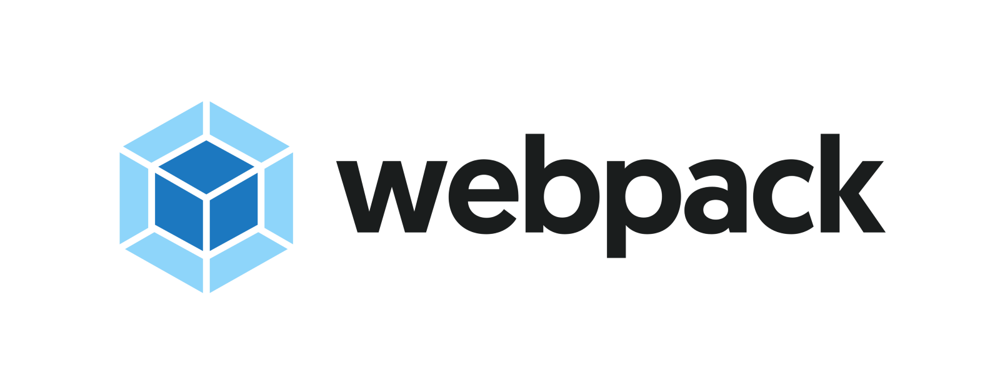

Each Quire project relies on 2 projects the quire-cli a command line interface(cli) to run commands to preview and build a static website, a PDF or an EPUB and the quire-starter-theme a front end devleopment toolkit that alllows users to shape the output of the website, PDF and EPUB. This page explains what makes these 2 projects work and what major dependencies currently make quire what it is.

> Hugo is a static HTML and CSS website generator written in Go. It is optimized for speed, ease of use, and configurability. Hugo takes a directory with content and templates and renders them into a full HTML website. Hugo relies on Markdown files with front matter for metadata, and you can run Hugo from any directory. This works well for shared hosts and other systems where you don’t have a privileged account.

Quire makes use of Hugo via the npm package <a href="https://www.npmjs.com/package/hugo-bin"/>`hugo-bin`</a>

Quire uses hugo's cli, templating system and http server. to create a way to preview your site while editig the front end code, build a static html site and aids Prince XML to create a PDF of your publication you are building.

To access the the templates files to customize your publication follow this path to edit hugo template files 

`<your-project-directory>/themes/quire-starter-theme/layouts`

> Prince can also be used by authors and publishers to typeset and print documents written in HTML, XHTML, or one of the many XML-based document formats. Prince is capable of formatting academic papers, journals, magazines, and books.

Quire uses the output of Hugo static-site generator to build a PDF as referenced abovee

> At its core, webpack is a static module bundler for modern JavaScript applications. When webpack processes your application, it internally builds a dependency graph which maps every module your project needs and generates one or more bundles.

Quire makes use of Webpack via the npm package <a href="https://www.npmjs.com/package/webpack"/>`webpack`</a>

Currently Quire starter theme uses the latest version of webpack 4 to bundle front end assets and support the development workflow. 

To modify the webpack configuration to your liking edit this file 

`<your-project-directory>/themes/quire-starter-theme/webpack.config.js`

then run `quire preview` to start editing the front end.

In the development of Quire there has been discussion about moving away from webpack in the starter theme, follow this <a href="https://github.com/gettypubs/quire/issues/35">link</a> to track the state of webpack in Quire.

### [pe-epub](https://github.com/peoples-e/pe-epub) and [pe-epub-fs](https://github.com/peoples-e/pe-epub-fs)

>"pee pub" makes epubs better. Our goal is to make it as easy as possible to output a valid epub. It's used in production over at The People's E-Book. pe-epub-fs extends pe-epub so you can import local assets from your filesystem rather than from the web.