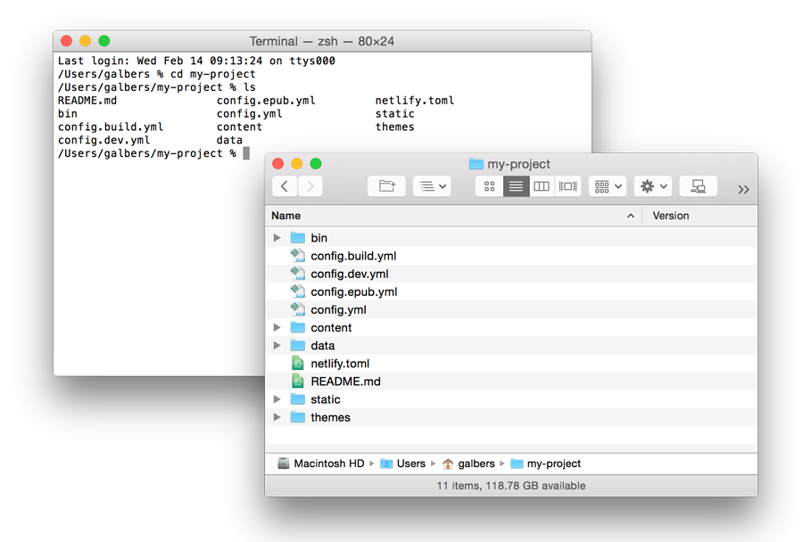

## Mac Installation Guide for Quire and Its Dependencies

The first thing you’ll need is a command line shell. Along with using it to run Quire, we’ll also use it to install some of Quire’s dependencies (the other programs Quire is dependent on in order to run).

### Working in a Command Line Shell

Macs already have a good shell installed. It’s called Terminal and can be found in the Applications/Utilities folder. (Or, hit Command-Space Bar and type "Terminal" to search for it.)

The shell is a text-based window into the contents of your computer, and a space where you can run program commands. Like opening a new graphical window on your computer showing the contents of a particular folder (directory), when you open your shell, you will also be in a particular directory.



When you open your shell program you will probably be in your main user directory by default. With the shell open, you can type `ls` ("list") to list the folders and files in your current location. Or type `cd` ("change directory") and the name of one of those other folders (like `cd Downloads`), and the shell will take you into it.

For more commonly used commands and shortcuts in Terminal for Mac, refer to this [cheatsheet] (https://github.com/0nn0/terminal-mac-cheatsheet).

### Install Quire and Its Dependencies

1. Open your your Terminal command line application. Note that when you type a password in the command line, the cursor doesn’t move, but your typing is being registered. Simply type the password, and hit Enter.

2. To install **Apple’s Xcode**, copy and paste the following command and hit enter.

    ```
    xcode-select --install
    ```

    After hitting enter, an additional alert notification will pop up. Click “Install” and follow the prompts.

3. Visit the **Node.js** site, and download and install the current LTS (long-term support) version: [https://nodejs.org](https://nodejs.org)

4. Visit the **PrinceXML** site, download the Mac OS version, and uncompress the folder: http://www.princexml.com/download/

5. Copy and paste the following two lines in your Terminal at once and press enter.

    ```
    cd Downloads/prince-11.3-macosx
    sudo ./install.sh
    ```

    Note that this assumes the file downloaded into your Downloads folder (the Mac default) and that the version you downloaded was 11.3, you can update the command if either of these is not the case.

6. The Terminal will ask for your computer password. After entering it another message will appear in the Terminal shell to confirm that PrinceXML should be installed in the `/usr/local` directory. Press enter.

7. When complete, type `cd` into the Terminal to return to your home/user directory.

    ```
    cd
    ```

8. Copy and paste the following line into your Terminal to download the **Quire CLI** (command line application) to your computer from GitHub.

    ```
    git clone https://github.com/gettypubs/quire-cli.git
    ```

    You may be asked to enter your GitHub username and password.

9. When complete, reset user permissions for your local directory by copying and pasting the following command into your Terminal and pressing enter.

    ```
    sudo chown -R $USER /usr/local
    ```

10. To intall Quire, copy and paste the following command into your Terminal and press enter.

    ```
    cd quire-cli
    npm install -g
    ```

11. When complete, type `quire --version` to confirm proper installation. It should return a version number, otherwise, if it says `command not found`, the Quire CLI has not been properly installed. Refer to the “Troubleshooting” section below.

### Troubleshooting

TK
