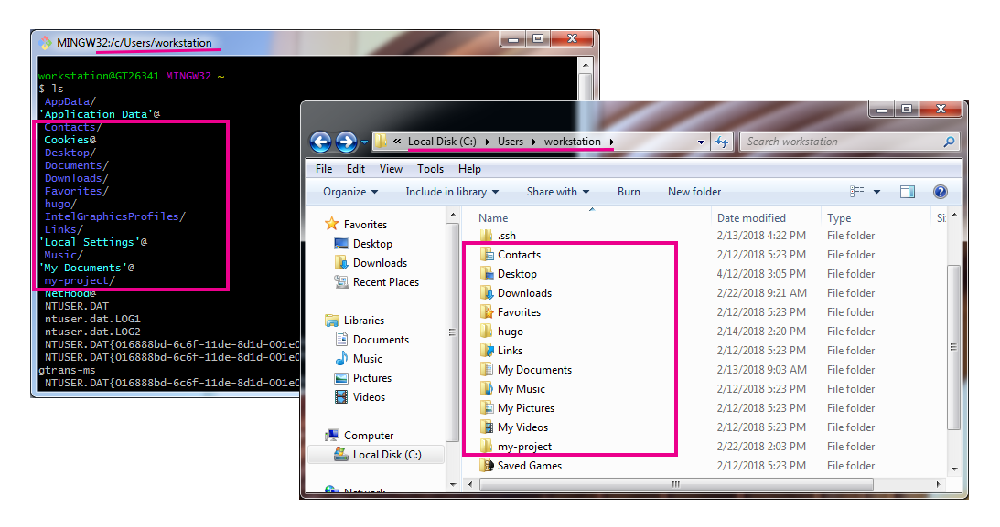

The full Quire system is not currently available to PC users. However, PC users can still start and work on Quire projects, preview the online edition, and output final files for it. They will not, however, be able to:

- Output PDF or EPUB editions
- Make changes to Style (.scss) or Javascript (.js) files inside the themes folder

## Command Line Shell

The first thing you’ll need is a command line shell. You’ll use it to install and run Quire.

The shell is a text-based window into the contents of your computer, and a space where you can run program commands. Like opening a new graphical window on your computer showing the contents of a particular folder (directory), when you open your shell, you will also be in a particular directory.



For PCs, we recommend using Git Bash as your command line shell. Installation instructions are below.

When you open your shell program you will probably be in your main user directory by default. With the shell open, you can type `ls` ("list") to list the folders and files in your current location. Or type `cd` ("change directory") and the name of one of those other folders (like `cd Downloads`), and the shell will take you into it.

## Installing Quire

1. Download and install **Git for Windows**: [https://gitforwindows.org/](https://gitforwindows.org/)

    Download the 32-bit or 64-bit version of Git for Windows to match your operating system. (Check your computer by clicking the Start button, right-clicking Computer, and then clicking Properties. Under System, you can view the system type.)

    When installing, you can accept all the default options.

2. In your User directory, create a folder called `hugo` and within that, a subdirectory called `bin`.

3. Download the 32-bit or 64-bit version of **Hugo 0.31.1** to match your operating system: [https://github.com/gohugoio/hugo/releases/](https://github.com/gohugoio/hugo/releases/tag/v0.31.1)

4. Right click on the downloaded file and use the WinZip “Extract to ...” option to extract the contents into the `hugo/bin` directory you created.

5. Open Git Bash, with the "Run as administrator" option (right click), and copy and paste the following line, replacing `YOUR-USER-DIRECTORY` with the name of your actual directory. Hit enter.

    ```
    setx PATH "%PATH%;C:\Users\YOUR-USER-DIRECTORY\hugo\bin"
    ```

6. When complete, type `hugo version` into Git Bash and hit enter to confirm proper installation. It should return a version number, otherwise, if it says `command not found`, the Quire CLI has not been properly installed. Refer to the “Troubleshooting” section below.

[*More directions for installation can be found in the [Hugo documentation](https://gohugo.io/getting-started/installing/#windows).*]

## Troubleshooting

TK
