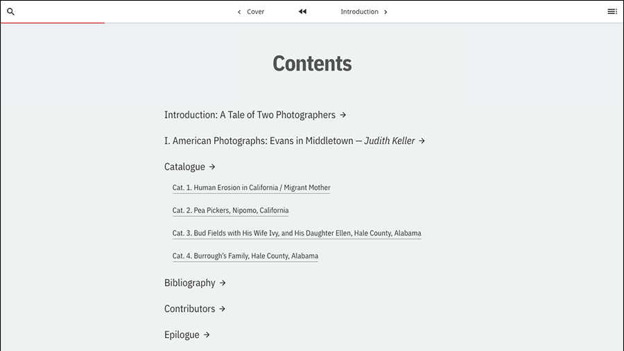

# Quire 

Developed by Getty, Quire is a new, multiformat publishing tool available for immediate access and use. Quire is in a limited beta, © J. Paul Getty Trust, and not yet released as open-source software. For a free license to use Quire, please complete [this form](https://docs.google.com/forms/d/e/1FAIpQLScKOJEq9ivhwizmdazjuhxBII-s-5SUsnerWmyF8VteeeRBhA/viewform).

For information on **installing, updating, and uninstalling Quire (macOS + Windows) and Quire commands** please refer to the [Quire documentation](https://quire.getty.edu/documentation/install-uninstall/). 

## Quire Default Theme

This default theme is a full-featured theme designed to showcase and make use of Quire’s core features out of the box, and is included by default when starting a new Quire project with the `quire new` command. The default theme includes support for a variety of page types: page, contents, cover, essay, entry, and splash. Also included are two sub-themes, "modern" (first three screenshots below) and "classic" (second three screenshots below), which can be controlled with the `$theme` variable as documented below.

## Defined Variables

This default theme includes a number of style variables intended to allow for relatively easy customization without having to dig into the stylesheets and CSS markup. They are explained below and can be found and changed in `/source/css/variables.scss` file. Take special note of thee `$theme` variable which can be set to "modern" or "classic", and the `$accent-color` variable which will give your publication a distinct feel in coloring all links, buttons and other navigation elements.

| Variable Type | Variable | Expected Value | Description | 
| ------------- | -------- | -------------- | ----------- |
| Primary | $accent-color | color value  | The color of buttons, links and navigation elements |
| | $content-background-color | color value | Main text area background color |
| | $secondary-background-color | color value  | Additional background color, only for modern version of the theme |
| | $theme | "modern", "classic" | Shifts the overall feel and typography of the publication  |
| | $navbar | "normal", "accent" | Predefined options for your navbar, white or the accent color |
| Page typography | $quire-base-font-size | unit value | 16px default |
| | $quire-page-paragraph-style | "line-space", "indent" | Paragraph display styles, either a line space and no indent, or an indent and no line space | 
| Cover typography | $quire-cover-text-color | color value | |
| | $quire-cover-text-scale | integer | Use decimal numbers such as .8 or 1.3 to shift the text larger or smaller |
| Menu colors | $quire-menu-color | color value | |
| | $quire-menu-text-color | color value | |
| Image viewer colors (pop-up figure viewer & entry page viewer) | $quire-entry-image-color | color value | The background of the image viewer on entry pages | 
| | $quire-entry-image-icons-color | color value | | 
| Highlight color | $quire-hover-color | color value | Used on active links and when hovering over table rows |
| Print/PDF output | $print-width | unit value | 8.5in default|
| | $print-height | unit value | 11in default |
| | $print-bleed | unit value | .125in default | 
| | $print-base-font-size | unit value | 8.5pt default |
| | $print-text-color | color value | Specifying a plain black will avoid excessive color printing costs |
| | $print-splash-color | color value | Background color for full-bleed splash pages | 
| | $print-entry-image-color | color value | Background color for full-bleed image pages | 
| | $print-entry-image-display | "all", "first" | Output "all" the images associated with an object on an entry page, or only the "first", main image |
| Fonts | $quire-primary-font | font name | This theme includes three embedded, open license fonts, (Noto Sans, Noto Serif, and IBM Plex Sans Condensed) and also uses the widely available Times. While other fonts can be specified for use, do so with caution and line spacing, element width and margin can all shift from font to font. |
| | $quire-headings-font | font name | See above |
| | $quire-footnotes-font | font name | See above | 
| | $quire-navigation-font | font name | See above |
| Navbar | $quire-navbar-color | color value | | 
| | $quire-navbar-hover-color | color value | | 
| | $quire-navbar-text-color | color value | | 
| Cover colors | $quire-cover-color-1 | color value | The cover includes a gradient of two colors, specified here, and a white/transparent wave graphic specified in the cover.md of the content files |
| | $quire-cover-color-2 | color value | |
| Layout sizes | $quire-menu-width | unit value | 352px default |
| | $navbar-height | unit value | 3rem default |
| | $quire-entry-header-height | unit value | 6rem default, determines the relative height of the entry page image viewer when in horizontal viewing mode | 
| | $quire-map-height | unit value | 500px default | 
| | $quire-deepzoom-height | unit value | 500px default |

## Special Classes 

| Class | Description |
| ----- | ----------- |
| page-one | For PDF output, should be used on the page/chapter where you want page 1 to start, `class: page-one`, often an Introduction or first essay rather than the Contents pages or other frontmatter |
| backmatter | Can be applied to Markdown text with the `q-class` shortcode and text will be styled smaller, like the default footnotes style
| is-pulled-left, is-pulled-right | Can be applied to figures or figure groups with their shortcodes, will make figures roughly half-column width and will float them to the left or right of the text |
| brief, list, abstract, grid | Can be applied to pages with a `type: contents`, will alter how the contents are displayed |
| side-by-side, landscape | Can be applied to pages with a `type: entry`, will alter how the image viewer is displayed |

## Configuration Parameters

Outside of the theme files themselves, a Quire project will also have a config.yml file which includes a number of parameters the theme relies on. 

| Parameter | Expected Value | Description |
| --------- | -------------- | ----------- |
| searchEnabled | boolean | Turn on or off the built-in text search capability for users |
| licenseIcons | boolean | Whether or not to display Creative Commons license icons |
| pageLabelDivider | string | ". " default, etermines the text/spacing to be inserted between page .label and page .title |
| citationPageLocationDivider | string | ", " default, determines the text/spacing to be inserted between the citation and the page number in the q-cite shortcode |
| displayBiblioShort| boolean | Whether a bibilography generated with the q-cite or q-bibliography shorcodes should display the short form of the reference, along with the long. | 
| imageDir | string | "img" default, the directory in the `/static/` directory where you put your images |
| tocType | "full", "short" | "short" will hide all sub-section pages |
| menuType | "full", "short" |  "short" will hide all sub-section pages |
| prevPageButtonText | string | "Back" default |
| nextPageButtonText | string | "Next" default |
| entryPageSideBySideLayout | boolean | Entry pages can have a side-by-side layout with image on the left and text on the right, this can be controlled by `class: side-by-side` in the page YAML, or globally with this parameter |
| entryPageObjectLinkText | string | "View in Collection" default |
| figureLabelLocation | "on-top", "below" | Whether the figure label is "on-top" of the image in the upper left corner, or "below" it with the caption | 
| figureModal | boolean | If figures should be clickable to open into a full-screen modal window |
| figureModalIcons | boolean | Whether to display icons with the figure modal links |
| figureZoom | boolean | Whether figures should zoom or not inside the modal | 

## Development Info

The default theme is paired with the [default starter](https://github.com/thegetty/quire/starters/default) demo content, and is included when running `quire new`.

Consult [the Quire documentation](https://quire.getty.edu/) for more detailed information on publishing with Quire.

### Testing

The testing framework used for the `default-theme` is [Cypress](https://www.cypress.io/). The cypress tests are run for every pull request through circleci. However if you are developing the `default-theme` you can run the tests locally also. This is possible by running `npm install` and then running `npm run test:e2e:local` from the `default-theme`directory.

## License

Copyright © 2021, J Paul Getty Trust.
